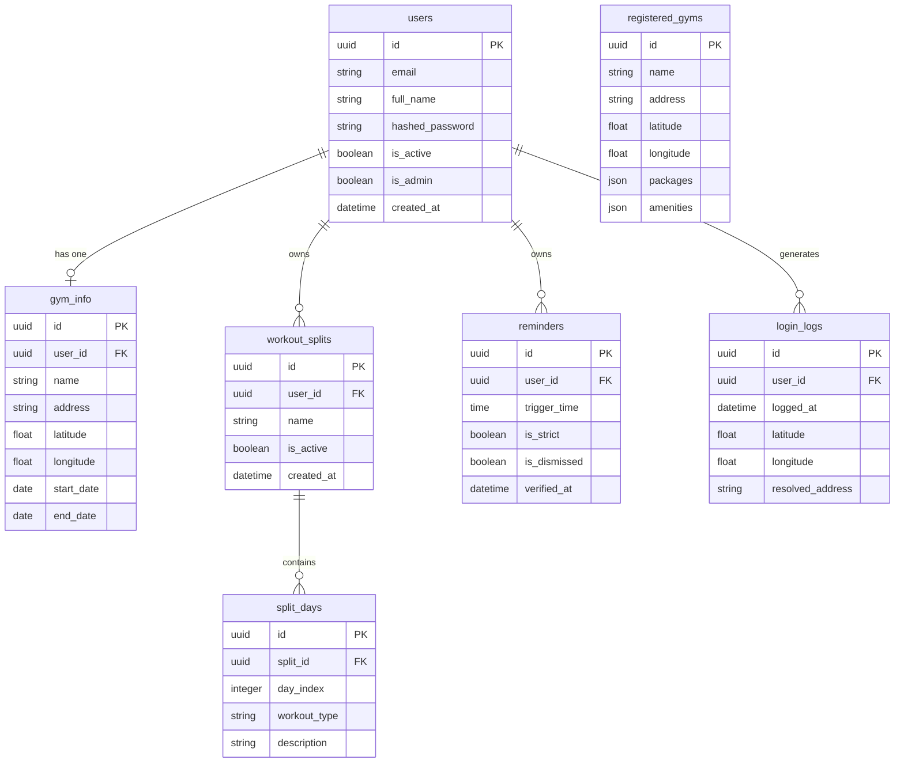
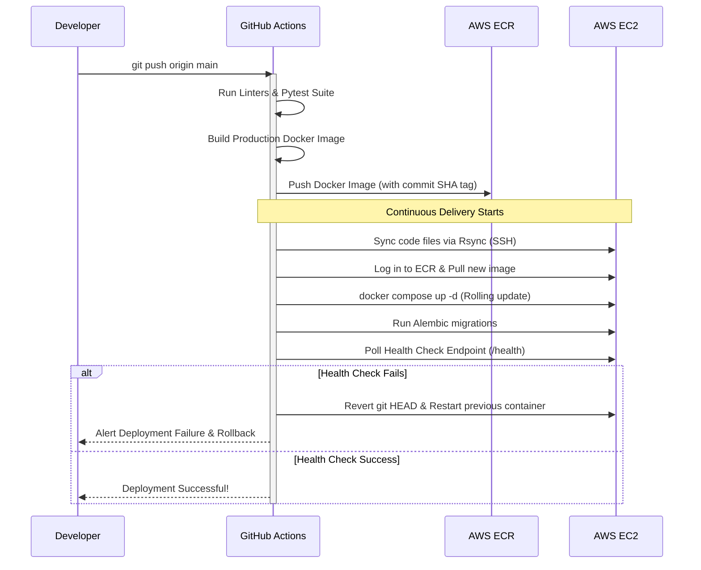

# FitIntelligence — Technical Documentation

FitIntelligence is a smart gym split calendar, membership tracker, and automated reminder application featuring GPS geofencing and Gemini AI-powered selfie verification.

---

##  System Architecture

The project is structured as a decoupled client-server application optimized for reliability, real-time background scheduling, and automated containerized deployment.


### Key Technical Choices
* **Frontend**: Bare React Native with TypeScript, using Expo libraries (e.g. for push notifications, location) to access native APIs while preserving full control over the Android/iOS directories. Zustand is used for clean, lightweight state management.
* **Backend**: FastAPI (Python 3.11+) for high-performance, asynchronous REST API endpoints, utilizing Pydantic models for request/response validation.
* **Database & ORM**: PostgreSQL database mapped via SQLAlchemy asynchronous ORM. Database migrations are managed via Alembic.
* **Task Scheduling**: Redis acts as a message broker for Celery. Celery Beat executes periodic tasks (like gym membership reminders and alarm checks) while Celery Workers handle async message dispatching.
* **AI Analysis**: Gemini 1.5 Flash is integrated directly for rapid, multimodal analysis of gym selfie uploads to verify workouts.

---

##  Database Schema & Models

Below is the entity-relationship model of the Postgres database.



---

##  Core Feature Workings

### 1. Gym Subscription Tracker
* Users input their gym's details, registration dates, package duration, and coordinates.
* The frontend calculates days remaining on the package. Card colors dynamically shift to warn users:
  * **Green**: > 7 days remaining
  * **Yellow**: 1 to 7 days remaining
  * **Red**: 0 days or expired

### 2. Split Builder & Calendar
* Five preset workout splits are provided (Push-Pull-Legs, Bro Split, Upper-Lower, Full Body, Arnold Split).
* Users can build custom splits mapping daily workout types (e.g. Chest/Triceps, Rest Day) to indexes from Monday to Sunday.
* The mobile console renders a 7-day horizontal calendar, highlights active workout days, and lists corresponding focus areas.

### 3. Smart Reminders & Verification
* **Standard Mode**: Reminders send standard dismissable push notifications.
* **Strict Mode**: Activates a full-screen lock overlay blocking application usage. To unlock the app, users must verify their gym presence using one of two methods:
  * **GPS verification**: Calculates the user's distance using the Haversine formula. The user must be within 300 meters of the registered gym's coordinates.
  * **Gemini AI Selfie Verification**: The user takes a gym workout selfie. The app uploads it to the backend where Gemini 1.5 Flash analyzes the image. Gemini responds with a JSON object (`{"is_gym": true/false, "explanation": "..."}`) to approve or reject the verification.

### 4. Admin Console & Analytics
* Restricted strictly to administrative users (`is_admin=True`).
* Displays registration analytics based on local system calendar boundaries (resetting exactly at midnight local time):
  * **New Today**: Registered since midnight local time today.
  * **New This Week**: Registered since Sunday midnight local time of the current week.
  * **New This Month**: Registered since 1st day of the current month.
  * **New This Year**: Registered since Jan 1st of the current year.
* Renders **Active Users & Geolocation Logs** showing full user lists, registration details, last active times, and map buttons to view user coordinates in Google or Apple Maps.

---

##  Production Deployment (AWS EC2 & ECR)

The application is deployed on an **AWS EC2** instance via an automated **GitHub Actions** CI/CD pipeline.



### Deployment Configuration Details
* **Multi-Container Composition**: Configured via `docker-compose.yml` specifying isolated networks, volume persistence for Postgres and Redis, and startup dependencies (healthcheck blocks).
* **Rollback Policy**: If the HTTP healthcheck fails 10 times consecutively, the workflow connects back to EC2, stashes changes, checkouts the previous git commit, and rebuilds/restarts containers to ensure zero downtime.
* **Environment Configuration**: Sensitive secrets (JWT secret, DB password, Gemini Key) are injected via GitHub Repository Secrets and compiled dynamically.

---

##  Local Setup and Administration

### Bootstrapping Administrative Accounts
To grant admin privileges to an account, use the utility script provided in `backend/promote_admin.py`.

```bash
cd backend
python promote_admin.py --email user@example.com
```
*Note: If the email does not exist in the database, the script will automatically register them and output a default password (`Admin123!`).*
